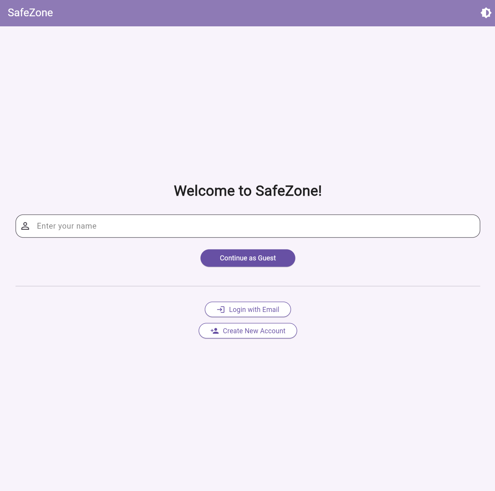
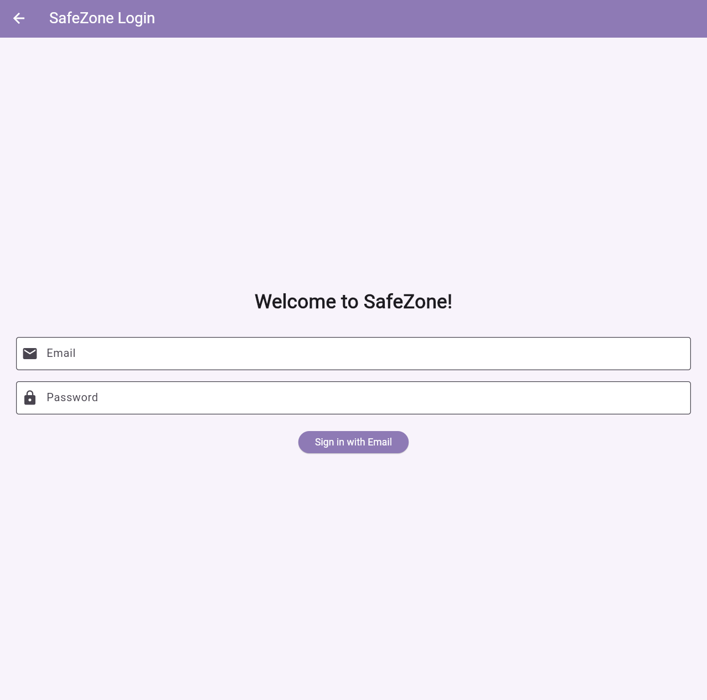
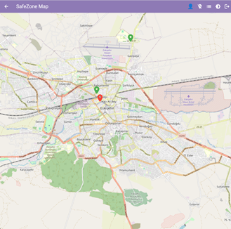
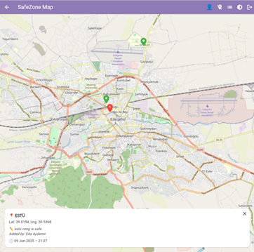
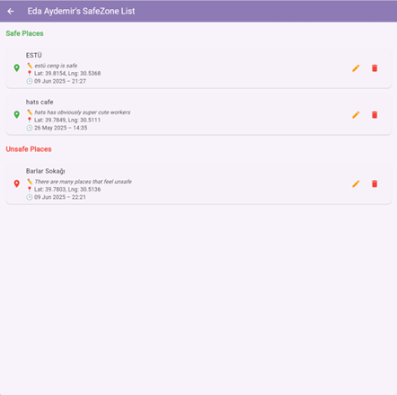
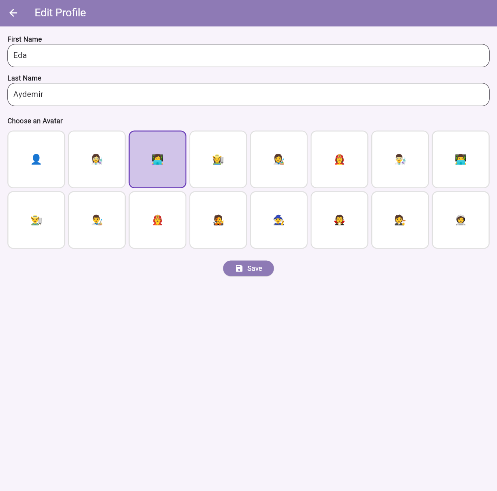

# 🛡️ SafeZone

> **"Because your safety matters."**  
> SafeZone is a humanitarian and beautifully designed mobile app that empowers users to collaboratively map out safe and unsafe locations in real time — creating a shared sense of security for everyone.
---

## 🌍 What is SafeZone?
SafeZone is a Flutter-based mobile application that leverages Firebase to help users:

- 📍 Mark locations as **Safe** or **Unsafe** on a live map.
- 🧑 Create a personalized profile with emoji avatars.
- 👀 Browse marked places from a clear and organized list.
- 🔐 Sign in or explore anonymously — guest users welcome!
- 📱 Navigate through an intuitive and accessible interface.

Whether you're a student, a traveler, or part of a local community — SafeZone helps you stay informed and contribute to public awareness.

> "Turn everyday places into shared signals of safety."

---
### 🖼️ Welcome Screens
| Welcome 1 | Welcome 2 | Welcome 3 |
|-----------|-----------|-----------|
|  |  |  |

## 📸 Screenshots
```
- [ ] 🚪   
- [ ] 🚪   
- [ ] 🚪 
- [ ] 🗺️   
- [ ] ➕   
- [ ] 📋   
- [ ] 👤   

```

---

## ✨ Core Features
- 🗺️ **Interactive Map**: View Safe/Unsafe markers using OpenStreetMap.
- ➕ **Add Markers**: Long-press to create safety markers with title and optional description.
- 🧑‍🎨 **Profile Editing**: Customize your display name and avatar emoji.
- 📋 **Marker Listing**: Browse categorized Safe and Unsafe places.
- 🔐 **Authentication**: Register or login via email — or continue as a guest.
- 🌗 **Theme Switching**: Light and dark mode toggle for comfort.
- 🔄 **Realtime Sync**: Firebase Firestore integration for live data updates.
- ✏️ **Edit & Delete**: Update or remove your markers anytime.

---

## 🛠️ Technologies Used
- **Flutter (Dart)** — UI framework
- **Firebase Auth** — User authentication
- **Firebase Firestore** — Cloud database
- **flutter_map** — Interactive map rendering
- **geolocator / latlong2** — Location services
- **intl** — Date formatting

---

## 📦 How to Run
```bash
git clone https://github.com/edaaydemir/SafeZoneApp.git
cd SafeZoneApp
flutter pub get
flutter run
```

---

## 📁 Folder Structure
```
/lib
├── models/           # Marker data structure
├── services/         # Firebase services (CRUD)
├── screens/          # Main UI screens
├── widgets/          # Reusable UI components
├── common/           # Shared constants, helpers, themes
```

---

## 👩‍💻 Developer
**Eda Aydemir**  
🎓 Computer Engineering Student @ Eskişehir Technical University  
💬 Firebase | Flutter | UX-first thinking  
📧 edaaydemir200081@gmail.com
🔗 GitHub / LinkedIn: (https://github.com/edaaydemir) / www.linkedin.com/in/edaaydemir12

---

## 🗓️ Next Steps
- [ ] Add multilingual support (EN/TR)
- [ ] Enable public marker viewing with filters
- [ ] Publish on Play Store (optional)
